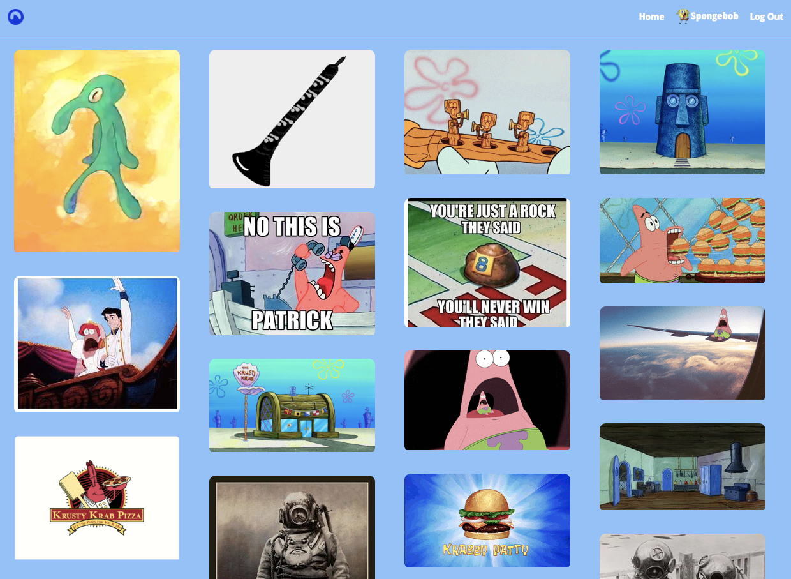

# Finterest
Finterest is a single-page web application, inspired by Pinterest. Finterest was built using Ruby on Rails with Redux.js and React.js.

[Finterest](http://finterest17.herokuapp.com/#/)

## Features
* Curate a user's home feed
* Create and edit Boards
* Upload Pin content from either local device or internet
* Follow topics
* Save other users' Pins to user's own boards

## Home Feed

### Home Feed Details:
* Finterest first prompts new users to select 5 topics to follow. These 5 topics are then attached to the user as followed topics. Finterest then searches all pins in the database for any pins that have the same topics the user chooses to follow. A polymorphic 'follows' table is used to link the user and the topics the user can follow.
```ruby
  # schema.rb
  # schema for polymorphic follows table
  create_table "follows", force: :cascade do |t|
    t.string   "followable_type"
    t.integer  "followable_id"
    t.datetime "created_at",      null: false
    t.datetime "updated_at",      null: false
    t.integer  "user_id",         null: false
    t.index ["followable_type", "followable_id"], name: "index_follows_on_followable_type_and_followable_id", using: :btree
    t.index ["user_id"], name: "index_follows_on_user_id", using: :btree
  end

  # user.rb
  # establishing association between users, follows, and topics
  has_many :topics,
    through: :follows,
    source: :followable,
    source_type: "Topic"

  # topic.rb
  has_many :followers,
    through: :follows,
    source: :followable,
    source_type: "Follower"

  # follow.rb
  belongs_to :user,
    class_name: :User,
    primary_key: :id,
    foreign_key: :user_id

  # home_pins.json.jbuilder
  # pins related to a user's followed topics are collected
  topic_pins = []
  @user.follows.each do |follow|
    topic_pins.concat(Pin.all.where(topic_id: follow.followable_id))
  end

  # if user is the author to a specific pin, that specific pin will not be sent in JSON response
  topic_pins = topic_pins.reject { |pin| pin.author_id == @user.id }

  json.pins do
    topic_pins.each do |pin|
      json.set! pin.id do
        json.extract! pin, :id, :pin_url, :board_id, :author_id, :topic_id
        json.image_url pin.image.url
        json.thumb pin.image(:thumb)
      end
    end
  end
```

## Libraries
The libraries used for Finterest:
* [React](https://github.com/facebook/react)
* [React-Router](https://github.com/ReactTraining/react-router)
* [Paperclip](https://github.com/thoughtbot/paperclip)
* [figaro](https://github.com/laserlemon/figaro)
* [BCrypt](https://github.com/codahale/bcrypt-ruby)

## Todos
- [ ] Implementation of user and board follows
- [ ] Explore
- [ ] Search
- [ ] Notifications
